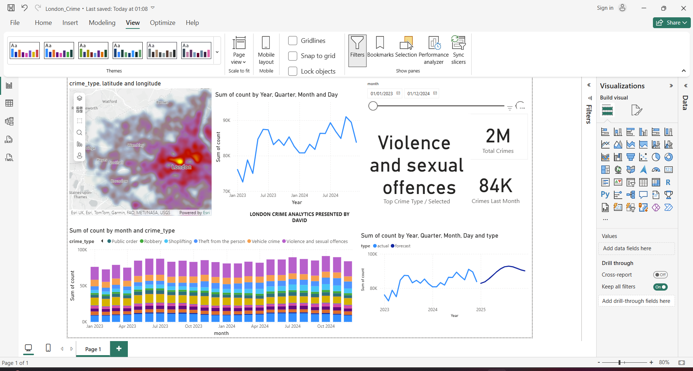
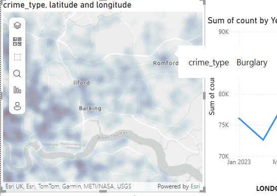
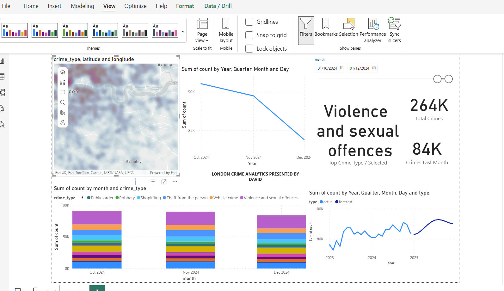
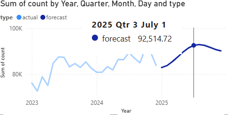

# London Crime Analytics (ArcGIS + Power BI + Python)

An end-to-end geospatial analytics project for London crime:
- **ArcGIS Maps** heatmap (Power BI) for hotspots
- **24 months of crime trends by type (2023–2024)**
- **Dynamic KPIs + slicers for interactive filtering**
- **Python ETL + Forecast** (pandas, scikit-learn) projecting into 2025

## Screenshots

**Dashboard Overview**  
*Full Power BI report: ArcGIS hotspots, KPIs, trends by crime type, and a 12-month forecast.*  

**ArcGIS Hotspot Map (Zoomed)**  
*Interactive map of London crimes, filterable by month, with tooltip details per location.*  

**KPI + Charts Reacting to Slicer**  
*Three-month selection: KPIs, bar chart, and line chart dynamically update with filters.*  

**Forecast Projection (July 2025)**  
*Python-generated forecast imported into Power BI, projecting the trend into 2025.*  

## Data
- Source: UK Police (Metropolitan Police Service)  
- Period: Jan 2023 – Dec 2024 (actuals) + Jan–Dec 2025 (forecast)  
- Attribution:  
  “Powered by TfL Open Data”  
  “Contains OS data © Crown copyright and database rights 2016 and Geomni UK Map data © and database rights [2019]”
